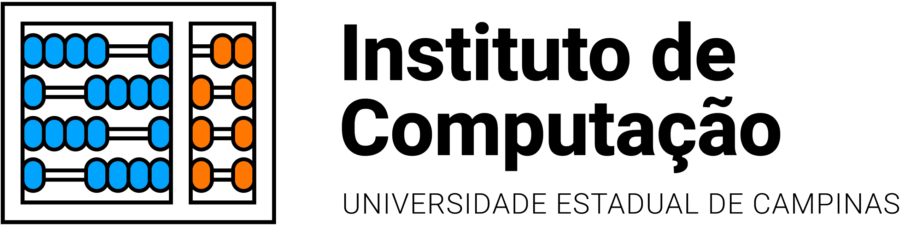

    
    

    

<h1 align="center"> INF319 - Projeto e Implementação Orientados a Objetos</h1>

<em><a href="/" target="_blank">Prof. Luiz E. Buzato</a></em>

<em><a href="/" target="_blank">Monitor Arthur V. de Lima Gomes</a></em>

Este repositório é destinado aos laboratórios da disciplina INF319 do curso de especialização em Engenharia de Software do Instituto de Computação da Unicamp.
  

> Para informações sobre a disciplina consulte o [LINK](https://ic.unicamp.br/wp-content/uploads/2019/10/INF-0319-Projeto-e-Implementa%C3%A7%C3%A3o-Orientados-a-Objetos.pdf).

## :arrow_forward: Aluno
* Rafael Mardegan Marquini
* Equipe 9

## :hammer: Tecnologias e Ferramentas
* [Java](https://www.oracle.com/java/)
* [Maven](https://maven.apache.org/)
* [JUnit](https://junit.org/junit5/)
* [Jenkins](https://www.jenkins.io/)
* [UML](https://www.uml.org/)
* [Eclipse](https://www.eclipse.org/)
* [ObjectAid](https://www.objectaid.com/)

## :computer: Laboratórios
* [Lab1](https://github.com/rmmarquini/engsoft-inf319-labs/tree/master/lab1)
* [Lab2](https://github.com/rmmarquini/engsoft-inf319-labs/tree/master/lab2)
* [Lab3](https://github.com/rmmarquini/engsoft-inf319-labs/tree/master/lab3)

## :computer: Avaliações
* [Test1](https://github.com/rmmarquini/engsoft-inf319-labs/tree/master/test1)

## :memo: Licença
MIT license.

---
Made with :coffee: by Rafa Mardegan.
