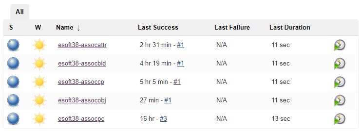

## Proposta do Laboratório
A proposta deste laboratório foi aplicar o conceito de Associações em OOP, à partir de testes unitários implementados e fornecidos pelos professores.

## Resultados das implementações
Há um _README_ em cada uma das implementações realizadas.

## Entrega dos exercícios
As entregas dos exercícios propostos foram disponibilizadas em meu repositório Jenkins privado no IC.

